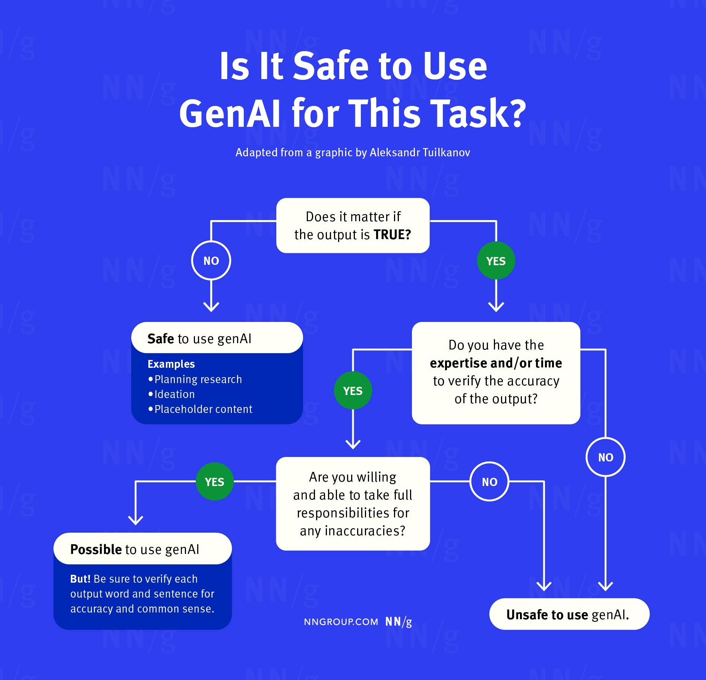

# AI-usage Course Policy

## Disclosure of AI Use

- [Link to the AI Use Disclosure Form](https://forms.office.com/r/jLUZtdGJrC)

## Policy on the Use of AI Content Generators for Coursework.

Generative AI is now part of the computing landscape. In this course, AI tools are allowed with guardrails. You may use them to support your learning, and you must do so carefully, transparently, and in line with academic integrity.

## General Guidelines

## For Learning

If used appropriately, AI can be a valuable learning aid. It can help you explore alternatives, check your understanding, and practice explanations before you head into industry. This course/section is a safe place to learn these skills. You are expected to experiment with AI in bounded ways, reflect on what helps, and build habits that transfer to professional environments.

**Good uses, with intent:**
- Clarify a concept, then restate it in your own words and cite the tool.
- Brainstorm cases studies, then revise and add original content yourself.
- Ask for counterexamples to stress test your design or argument.

**Not substitutes for learning:**
- Do not outsource reasoning, design decisions, or original analysis.
- Do not skip assigned readings or required steps because a tool summarized them. While summaries can be helpful for a quick overview, they are not a substitute for engaging with the material yourself. 

## For exams (Quizzes)

Given the nature of an online course, it is not practical to fully monitor or restrict the use of AI tools during exams and quizzes. While monitoring software exists, I have chosen not to use it, as strict enforcement would conflict with creating a welcoming and inclusive learning environment that I strive to foster.  

Instead, the exams and quizzes in this course are intentionally designed so that success depends on your **active participation** in all course components, including both live and asynchronous activities. The questions are structured to reward genuine engagement and understanding. In other words, relying on AI tools during an exam or quiz will not help you arrive at the correct answers and may even lead you astray.  

## Prompting

Prompting is the primary way you interact with these systems. Effective prompts are specific, scoped, and testable.

**Practical tips**
- State the task, constraints, and success criteria.  
- Provide small, worked examples, then ask for one more.  
- Ask the model to list assumptions, then verify each one.  
- Iterate. Shorten or refocus when the output drifts.

## Risk

As an educator, I have a professional and ethical responsibility to inform you of the risks. These AI systems are trained on large bodies of text and images (often, without consent from the original creators). They may remix existing works without citation, reproduce bias, invent fictional sources, and generate content that is similar to other students’ output (after all, most students use similar prompts and tools).

There is a **risk of inadvertently plagiarizing** when using these tools. Many AI chatbots and image generators create content based on existing works without proper attribution. Other students may also produce similar content using similar prompts. Therefore, you must **cite your sources** and **use these tools responsibly**. **Our plagiarism policy applies to every submission, and “AI did it” will not excuse any plagiarism.**

## Your responsibility

1) **Quality and appropriateness.** AI tools can be wrong and can reproduce discriminatory ideas. It is **your responsibility** to ensure the quality, correctness, and suitability of everything you submit.  
2) **Data care.** Be mindful of what you paste into these systems. Your assignments and learning logs may contain private information, including that of others. Do not enter classmates’ names, peer reviewers’ names, or any sensitive details into AI tools.  
3) **Healthy dependency.** Overreliance can erode your own critical thinking and writing. Use AI to augment your process, not to replace it.

---

## For every assignment submission, you are required to submit an "AI usage disclosure" 

Submitting this disclosure will help us understand and mitigate the risks associated with the use of AI tools in the course. The form will ask about your use of AI tools for the assignment and the extent to which you used them. Failure to submit the disclosure will be considered a violation of the academic policy and a penalty of` -25%` will be applied to your grade if the disclosure is not submitted / attached to each of your submissions.

## For every learning log submission, you are required to disclose the use of AI tools

For every learning log submission, students will include a brief statement declaring how much AI was used in their response. This declaration is based on the AI Usage Scale provided below. The declaration will help the teaching team and your peers understand the context of your work.

Similar to the AI usage disclosure for assignments, failure to include this statement will be considered a violation of the academic policy and a penalty of `-25%` will be applied to your grade if the disclosure is not included in your submission.

### AI Usage Scale

Select one of the following options (make sure to include the icon/emoji) to indicate the extent of AI use in your learning log submission:

  
🟢 Entirely by myself, no contribution from AI

  
The response was created entirely by the student without using AI tools.

  
🟡 Mostly by myself, some contribution by AI

  
AI was used minimally, for tasks like grammar checks, clarifications, or rephrasing.

  
🟠 Evenly split between myself and AI

  
The response reflects equal contributions from the student and AI, such as brainstorming or content generation with subsequent student refinements.

  
🟣 Mostly by AI, some contribution by myself

  
AI generated most of the content, and the student reviewed and made minor adjustments.

  
⚠️ Entirely by AI, no contribution from myself

  
The response was fully created by AI and reviewed by the student for accuracy.

## Audits of AI Disclosure Forms and Student Work

To uphold the integrity of coursework, the instructor will conduct regular audits of random students’ AI use disclosure forms throughout the semester. These audits will involve scheduled interviews where students will discuss their use of AI tools in assignments and learning logs. Additionally, the instructor will cross-reference the submitted work with the details provided in the disclosure forms.

If any inconsistencies are found between the disclosed AI usage and the actual content of the work, the student may be asked to provide further clarification. Persistent discrepancies or failure to provide a satisfactory explanation could lead to a review for potential academic integrity violations. These audits will be conducted continuously to ensure transparency and adherence to the AI usage policy, fostering a fair academic environment for all students.

## If you do not wish to use these tools, that is a valid decision.

The use of AI tools in education can be messy and unpredictable due to the risks mentioned earlier. Some students may have moral confusion or concerns about the uncertainty associated with using AI tools in their coursework. **If you do not wish to use them, that is a valid decision.** This policy aims to anticipate and mitigate any potential harms associated with AI tool usage, rather than promoting their use.

## I will not mark you down for the use or non-use of AI tools.

Grading will be done based on the rubric on an absolute scale, the use of AI tools will not negatively impact your grade.

**Please note that this policy on the use of AI tools is up for change as the term progresses. Changes will be communicated in-class and via this page.**

### Acknowledgements

This policy was developed based on the output of our in-class activity and discussion on September 16. 

The original inspiration for this policy came from [Dongwook Yoon](https://dwyoon.com/) at UBC and similiar versions were implemented in courses across UBC, SFU, UFV and Northeastern University.